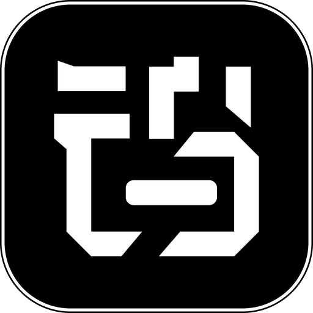

<div align="center">



# Tungsten Edge

**A per-window taskbar for macOS — switch to any window in one click, Windows-style clarity without the clutter.**

English · [中文](README.zh-CN.md)

### [⬇ Download for macOS](https://tungstenedge.app)

Ready-to-run builds live on the [official website](https://tungstenedge.app). This repository holds the source.

</div>

---

## Demo

**Multi-window management**


<table>
  <tr>
    <td align="center"><b>App drawer &amp; launcher</b></td>
    <td align="center"><b>Drag to organize</b></td>
  </tr>
  <tr>
    <td></td>
    <td></td>
  </tr>
</table>

---

## What it is

Tungsten Edge puts a **per-window taskbar** at the bottom of your screen. Every open window gets its own card — just like a Windows taskbar — so you can switch directly to any window with a single click. No more hunting through stacked windows, no Mission Control, no extra gestures.

Unlike a plain Windows-style task switcher, single-window apps stay collapsed as compact icons, so the strip never gets cluttered. Multi-window apps (four Finder folders, multiple browser windows) expand into individual labeled cards. The result: the compactness of the macOS Dock combined with the per-window clarity of a Windows taskbar — without inheriting its problems.

## Features

- **Window-level taskbar** — one card per window; multi-window apps split into multiple cards; click to switch / minimize.
- **Smart native-tab merging** — apps where "tabs are windows" (Ghostty, Finder) keep a stable card while you switch tabs: it won't jump around or split.
- **Pinned messaging apps + badges** — messaging apps (WeChat, Feishu, …) get a persistent pinned entry and mirror the Dock's red unread badge.
- **App drawer** — stash rarely-used apps into a drawer on the right to keep the strip clean; pin favorites in the drawer to use it as a launcher.
- **Drag to organize** — reorder cards by dragging; drag a card into the drawer to stash it; drag it back out and it lands exactly where you drop it.
- **Menu bar and Settings** — the status menu holds what you flip mid-session (the wake delays for the Dock and for Tungsten Edge); everything else — Open at Login, the appearance preferences (Show Shelf, hover names, maximized-window avoidance, taskbar size) and update checking — lives in the settings window.
- **Edge auto-hide** — Tungsten Edge can hide itself and wake from the bottom edge after the delay you choose; moving away hides it again after about 0.2s.
- **Frosted-glass look** — native-grade translucency that blends into the desktop.
- **Multi-display follow** — resting the pointer on another screen's bottom edge moves the taskbar there automatically.
- **Blink-free native full-screen entry** — before a standard green-button or `Control-Command-F` full-screen transition, Tungsten Edge moves its panels out of the transition snapshot. This is enabled by default and can be turned off in Settings.

> **Note:** the interface ships in **English and Simplified Chinese**, following your system language. To pick one explicitly, use **System Settings ▸ General ▸ Language & Region ▸ Applications**.

## Requirements

- macOS 12.0 (Monterey) or later
- Intel and Apple Silicon (universal binary)
- On first launch you'll be asked to grant **Accessibility** permission (used to read and manage windows; the app guides you through it).

### Global input observation

Entering a native full-screen Space lets the system's transition snapshot catch the taskbar, which shows up as a one-frame blink. Removing it requires hiding the taskbar *before* your input reaches the target app, so Tungsten Edge observes global **left-click, key-down and trackpad gesture** events. It recognizes only these four:

- the standard window green button
- the exact `Control-Command-F` shortcut
- `Control-Left` / `Control-Right` (when switching into an adjacent full-screen Space)
- a three-finger horizontal swipe (same case)

Ordinary input is not recorded, logged, modified, or sent anywhere. The listener is enabled by default; turn off **Predict full-screen transitions to prevent taskbar flicker** under **Advanced** in Settings to disable it completely.

Separately, when **Reverse mouse scroll direction** (Settings › General, off by default) is on, a second event tap watches scroll-wheel events and inverts the direction values of discrete mouse-wheel ones — that inversion is the whole feature; trackpad and Magic Mouse events pass through untouched, and nothing is recorded or sent anywhere. The tap exists only while the switch is on. Kill switch for diagnostics: launch with `DOCK_SCROLL_REVERSER=0`.

macOS suppresses key events from global event taps while Secure Input is active, such as in a protected password field. During that time the keyboard shortcuts cannot be recognized in advance; green-button and trackpad-gesture detection are unaffected.

## Install

### Option 1 — download the installer (recommended)

1. Download the latest `.dmg` from the [official website](https://tungstenedge.app).
2. Open it and drag **Tungsten Edge** into your **Applications** folder.
3. Double-click to open it. On first run, grant **Accessibility** permission when prompted (see [Grant Accessibility permission](#grant-accessibility-permission) below).

### Option 2 — Homebrew (for technical users)

```bash
brew tap moonbai-studio/tungsten-edge
brew trust moonbai-studio/tungsten-edge
brew install --cask tungsten-edge
```

> The `brew trust` step is required for any third-party tap.

## Grant Accessibility permission

As of **v0.9.0 Tungsten Edge is signed and notarized by Apple**, so it opens with a plain
double-click — no right-click workaround needed.

One step remains: Tungsten Edge needs **Accessibility** permission to read and manage your
windows, and it guides you through this on first run:

- Open **System Settings → Privacy & Security → Accessibility**, find **Tungsten Edge**, and **turn on its switch**.

> **Upgrading from v0.8.0 or earlier:** v0.9.0 switched to a proper Developer ID signature, so
> macOS treats it as a *different* app and your old Accessibility grant no longer applies.
> **Quit Tungsten Edge**, select the old **Tungsten Edge** entry in the Accessibility list and
> remove it with the **−** button, then reopen Tungsten Edge and grant it again. One time only;
> future updates will not need this.

## Status menu and Settings

Preferences live in two places, and the split is deliberate: the **status menu** carries only what you flip mid-session, the **settings window** carries everything else.

### Status menu

- **Tungsten Edge (⌥⇧⌘D to show/hide)** — a greyed-out section header, not a clickable command. Below it sits a compact slider for the taskbar's own wake delay: `Always Visible`, `0.1s`–`3.0s`, or `Never Wake`. The global `⌥⇧⌘D` shortcut switches between always-visible and your last auto-hide delay; it is the system Dock's `⌥⌘D` plus Shift, which also releases the older `⌥⌘E` back to Safari and Finder. You can record a different combination in Settings → General. If the shortcut cannot be registered, the menu simply stops showing the key hint.
- **The Dock (⌥⌘D to show/hide)** — likewise a section header. `⌥⌘D` belongs to macOS, so it is named here as plain text rather than claimed as a shortcut. Its slider sets the **native Dock's** wake delay (`Always Visible`, `0.1s`–`3.0s`, `Never Wake` — drag to `Never Wake` and the Dock stops popping up at the screen edge entirely). Moving it stages a draft and reveals a confirm row; nothing is written until you press it, because every write restarts the Dock and flashes the screen.
- **Dock Settings…** — opens Desktop & Dock on Ventura and later, or Dock & Menu Bar on macOS 12. It only opens System Settings; it never writes Dock preferences or restarts Dock.
- **Settings…** — opens the settings window described below.
- **Install x.y.z…** — appears only while an update is waiting to be installed, marked with a small red dot (the menu-bar icon carries a dot too). One click downloads, installs and relaunches. Manual checking lives in the settings window's About section.

### Settings window

Open it from **Settings…** in the status menu, or by **right-clicking the drawer capsule** at the right end of the taskbar. (`⌘,` does not work in normal operation: Tungsten Edge runs as a menu-bar app and has no menu bar of its own to hang it on.)

- **General**
  - **Open at Login** — on macOS 13 and later this goes through the system's Login Items; if macOS asks for approval, open Login Items in System Settings and approve Tungsten Edge there. On macOS 12 it is written to System Preferences → Users & Groups → Login Items, where you can also see and remove it.
  - **Show/hide taskbar shortcut** — click the recorder, press a new combination, done (default `⌥⇧⌘D`; *Reset to Default* brings it back). Combinations that would clash with macOS — `⌥⌘D`, Option-only, Control-Option without Command — are rejected with an explanation, and if another app already owns the combination the previous shortcut stays active.
  - **Reverse mouse scroll direction** — off by default. Flips mouse-wheel scrolling system-wide, like Scroll Reverser, so the wheel can scroll Windows-style while the trackpad keeps macOS natural scrolling. Trackpads and Magic Mouse are not affected. If Scroll Reverser or Mos is also running, the two cancel out — keep only one. See [Global input observation](#global-input-observation) for what this touches.
- **Taskbar**
  - **Show Shelf** — shows or hides the shelf chip. Unchecking it only hides the chip; stashed file references are kept and come back when you check it again. Note that with the shelf hidden *and* no pinned folders, the whole folder zone disappears, so the taskbar has no external-file drop target and no **Add Folder…** entry — check it back on to get them.
  - **Show app name on hover** — turn it off and moving the pointer across the taskbar no longer pops up app names.
  - **Keep maximized windows above the taskbar** — lifts the bottom edge of a screen-filling window above the taskbar. This resizes other apps' windows, so it is off by default.
  - **Taskbar Size** — four tiers (Small / Medium / Large / Extra Large) that scale the taskbar and its capsule together: icons, labels, spacing, corner radius and bar height all follow. Medium is the default and matches the real Dock's height. Switching applies instantly; an open drawer closes so it can be re-measured. The drawer's own contents and the folder / shelf popups keep their current size.
- **Advanced** — **Predict full-screen transitions to prevent taskbar flicker** (on by default; see [Global input observation](#global-input-observation) for exactly what it watches).
- **About** — version, **Check for Updates…** (when an update is available you get an update window: one click downloads, installs and relaunches — no more downloading a disk image and dragging it across by hand), **Check for updates automatically** (on by default; turn it off and Tungsten Edge stops contacting the network on a schedule, checking only when you click *Check for Updates…*), a **Feedback** form (write a message, optionally leave a contact, hit Send — only your message, the contact you enter, the app version, your macOS version and the interface language are transmitted), and the founding-user mailing list.

Writing native Dock preferences requires a non-sandboxed build, because sandboxed apps cannot write Dock preferences or restart Dock. Opening the settings pane works in either environment.

## Recommended setup (align the minimize animation to the bottom)

> On first run, if the Dock is not already set to hide itself, Tungsten Edge offers to do it for
> you — one click. You will not see that prompt if you have already hidden the Dock. The rest of
> this section is the manual route, plus the suggestions the prompt does not cover.


If your native Dock lives on the **side or top** of the screen, minimizing a window flies the animation toward the native Dock — out of sync with this bottom taskbar. Move the native Dock back to the **bottom** and set it to auto-hide; the minimize animation will then shrink toward the bottom, matching Tungsten Edge:

- **System Settings → Desktop & Dock → Position on screen → Bottom**, and turn on **Automatically hide and show the Dock**.

To keep the native Dock from ever reappearing, drag the Dock slider in the status menu to `Never Wake`: hovering at the screen edge will no longer wake it.

## Roadmap

This is an early public build (v0.3). Known limitations and what's next:

- **Signed and notarized** since v0.9.0 → opens with a plain double-click.
- **Localization** → English and Simplified Chinese are both shipped and follow the system language. A Chinese version of this README is at [README.zh-CN.md](README.zh-CN.md).
- Feedback and issues are very welcome.

## Community

**WeChat Group**


The QR code is updated weekly. If it has expired, please leave a message in [Issues](https://github.com/moonbai-studio/tungsten-edge/issues) and I'll renew it promptly.

Tungsten Edge recognizes and thanks the [LINUX DO](https://linux.do/) community for providing a place for discussion and feedback.

## License

Copyright (C) 2026 Moonbai Studio.

Tungsten Edge is licensed under the GNU General Public License v3.0 or later (`GPL-3.0-or-later`). See [LICENSE](LICENSE).

The application source code, build scripts, and assets required to build it are published in this repository. Code-signing certificates, notarization credentials, account credentials, and other secrets are not source code and are never included.

The license covers the source code; it does not require official signed/notarized binaries or related services to be provided free of charge.

The names "Tungsten Edge" and "钨极" and the logo are trademarks and are not covered by the GPL. Forks and self-built binaries must use a different name and icon — see [TRADEMARK.md](TRADEMARK.md).

---

## Developers

Release notes for every version are archived under [`Docs/Archive/Releases/`](Docs/Archive/Releases).

Build & run:

```bash
./Scripts/build_and_run.sh
```
</content>
